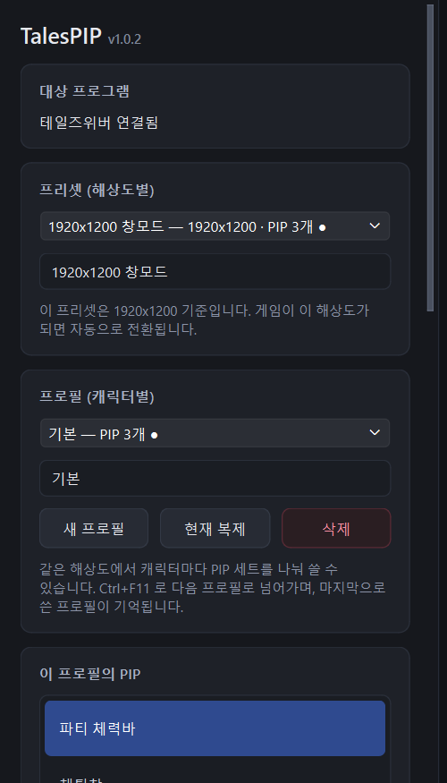
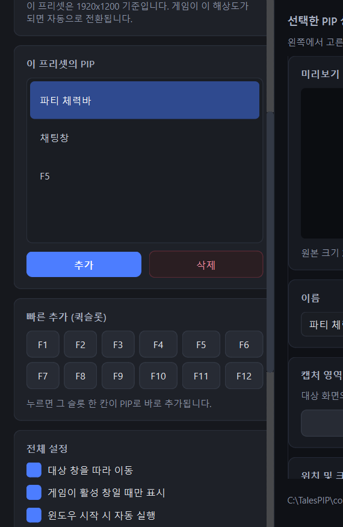
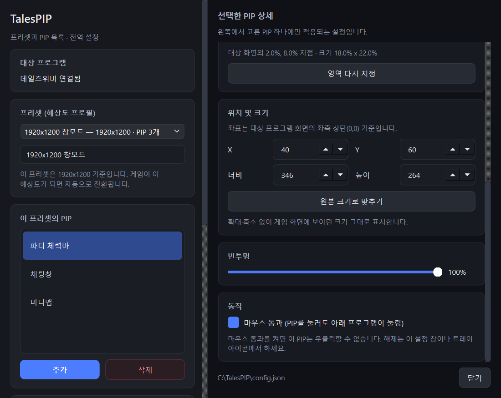
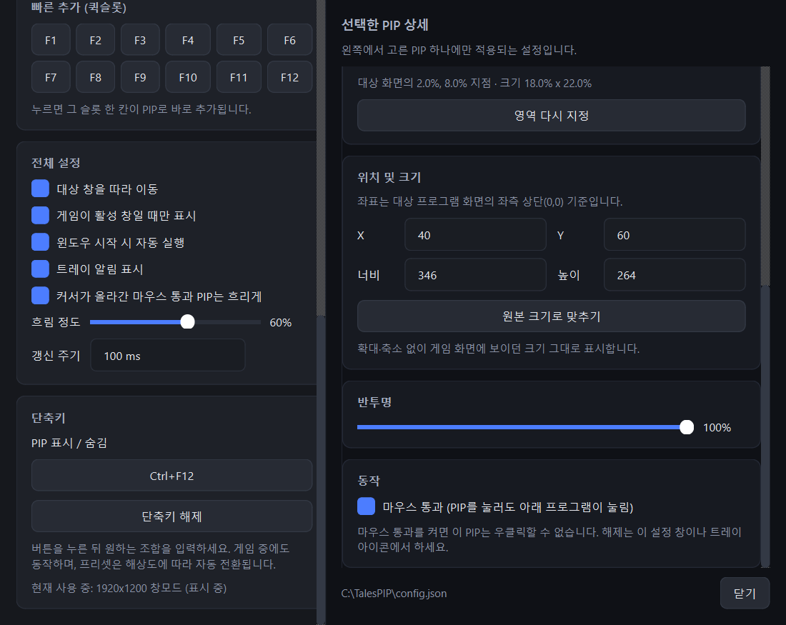

# TalesPIP

테일즈위버 화면의 특정 영역을 잘라내 항상 위에 띄우는 PIP(Picture-in-Picture) 도구입니다.

게임 창에 가려 보이지 않는 정보(체력바, 채팅, 미니맵 등)를 원하는 위치에 따로 띄워두고 사용합니다.

## 주요 기능

- **영역 크롭 PIP** — 게임 화면의 원하는 영역을 드래그로 지정해 별도 창으로 표시
- **해상도 프리셋 (4개)** — 크롭 좌표는 해상도마다 달라지므로, 해상도별로 영역 세트를 분리해 관리
  - 게임 해상도가 바뀌면 일치하는 프리셋으로 **자동 전환**
  - 등록되지 않은 해상도면 비어 있는 프리셋으로 전환해 새로 구성
- **프로필** — 한 프리셋 안에서 PIP 세트를 여러 개로 나누어 캐릭터마다 다른 구성 사용
  - 단축키 한 번으로 다음 프로필로 전환, 마지막으로 쓴 프로필을 기억
- **화면 감지** — 게임 화면을 읽어 PIP를 띄울 상황인지 판단
  - 캠릭터가 접속하기 전에는 띄우지 않고, 선택창으로 나가면 다시 숨김
  - 오픈마켓처럼 가려야 할 창을 직접 등록해 둘 수도 있음
- **전역 단축키** — PIP 전체 표시/숨김 (게임 창이 포커스를 잡고 있어도 동작, 조합 직접 지정)
- **마우스 통과** — PIP를 클릭해도 아래 게임이 눌리도록 설정 가능
- **반투명 / 위치 / 크기** — PIP별로 개별 설정, 수치 입력도 지원
- **대상 창 추적** — 게임 창을 옮기면 PIP도 함께 이동
- **활성 창 연동** — 게임이 활성 창이 아닐 때 자동 숨김
- **트레이 상주** — 게임이 꺼지면 PIP만 숨기고 대기, 다시 켜지면 마지막 상태로 복원

## 동작 방식

화면 캡처가 아니라 **DWM 썸네일 API**(`DwmRegisterThumbnail`)를 사용합니다.
Windows가 대상 창의 렌더링 결과를 직접 합성해주므로:

- DirectX로 그리는 게임 화면도 정확히 표시됩니다
- 다른 창이 게임을 가려도 영향이 없습니다
- PIP가 자기 자신을 다시 비추는 무한 반복이 발생하지 않습니다

## 요구 사항

- Windows 10 / 11
- 테일즈위버 클라이언트 (`InphaseNXD.exe`)
- 소스로 실행할 경우 Python 3.10 이상

## 설치

[Releases](https://github.com/kimdonggeol/TalesPIP/releases)에서 `TalesPIP.exe`를 받아
원하는 폴더에 두고 실행하세요. 설치 과정은 없습니다.

설정이 exe 옆의 `config.json`에 저장되므로 쓰기 가능한 폴더에 두세요.

소스로 실행하려면:

```bash
pip install -r requirements.txt
python tales_pip.py
```

화면 감지에만 `numpy` 와 `opencv-python` 이 쓰입니다.
없어도 나머지 기능은 그대로 동작하고, 자동 숨김만 비활성화됩니다.

## 사용법

### 1. 실행

실행하면 창이 뜨지 않고 트레이에 상주합니다. **트레이 아이콘을 더블클릭**하면 설정 창이 열립니다.

테일즈위버는 따로 지정할 필요 없이 자동으로 찾습니다.
게임이 아직 꺼져 있으면 `테일즈위버 실행 대기 중`으로 표시되고, 게임을 켜면 자동으로 연결됩니다.

### 2. 영역 추가



게임을 원하는 해상도로 켠 뒤, 좌측 **이 프로필의 PIP** 카드에서 **추가**를 누릅니다.
게임 화면 위로 선택 창이 덮이면서 파란 테두리와 `영역 추가 중` 안내가 표시됩니다.
원하는 부분을 **드래그**하면 그 자리에 PIP가 생성되고, 잠깐 깜빡여 위치를 알려줍니다.

생성된 PIP는 **드래그해서 이동**, **테두리를 잡아 크기 조절**할 수 있습니다.
PIP를 **우클릭**하면 영역 추가·수정·삭제와 마우스 통과를 바로 켜고 끌 수 있습니다.

### 3. 퀵슬롯은 클릭 한 번으로



게임의 `F1` ~ `F12` 퀵슬롯은 드래그할 필요 없이 버튼만 누르면 됩니다.
슬롯 바는 화면 좌측 하단에 고정된 크기로 붙어 있어서, 칸 위치를 해상도에서 바로 계산합니다.

추가된 PIP는 **원본의 2배 크기(52x52)** 로, 화면 정중앙에서 오른쪽 60px 위치에 생성됩니다.
그대로 원하는 자리로 끌어다 놓으면 됩니다.

### 4. PIP 하나씩 다듬기



좌측 목록에서 PIP를 고르면 우측에 그 PIP의 설정이 나옵니다.

| 항목 | 설명 |
|---|---|
| **미리보기** | 선택한 영역이 실시간으로 표시됩니다 (게임 실행 중일 때) |
| **캡처 영역** | `영역 다시 지정`으로 새로 드래그하거나, 게임 화면 기준 픽셀 좌표를 직접 입력합니다 |
| **위치 및 크기** | 좌표는 **게임 화면 좌측 상단이 (0,0)** 기준입니다. **배율** 버튼은 원본 대비 100 / 150 / 200 / 300% 크기로 맞춥니다 |
| **반투명** | 이 PIP만 투명하게 만듭니다 |
| **마우스 통과** | 켜면 PIP를 클릭해도 아래 게임이 눌립니다. 대신 그 PIP는 우클릭할 수 없으니, 해제는 설정 창이나 트레이에서 하세요 |

### 5. 해상도가 여러 개라면

크롭 좌표는 **해상도마다 달라집니다.** 게임 UI가 해상도에 정비례해 움직이지 않기 때문에,
1920x1200에서 잡은 영역은 1280x720에서 엉뚱한 곳을 가리킵니다.

그래서 **프리셋 = 해상도 프로필**입니다.

1. 해상도 A로 게임을 켜고 프리셋 1에 영역들을 추가합니다 (이때 해상도가 자동 기록됩니다)
2. 해상도 B로 바꾸면 비어 있는 프리셋 2로 자동 전환됩니다
3. 프리셋 2에 영역들을 추가합니다

이후에는 **해상도만 바꾸면 프리셋이 알아서 전환**됩니다. 수동으로 고를 일이 없습니다.

### 6. 캐릭터가 여러 명이라면

해상도는 같은데 캐릭터마다 보고 싶은 것이 다를 수 있습니다.
그럴 때 프리셋을 더 쓰지 말고 **프로필**을 나누세요.

1. 좌측 **프로필 (캐릭터별)** 카드에서 **새 프로필** 또는 **현재 복제**를 누릅니다
2. 이름을 캐릭터명으로 바꾸고 그 프로필에 PIP를 구성합니다
3. 게임에서 캐릭터를 바꿔 접속하면 `Ctrl+F11` 로 프로필만 넘깁니다

프로필은 게임 화면을 읽어 자동으로 바뀔 수는 없습니다.
대신 **마지막으로 쓴 프로필을 프리셋별로 기억**하므로,
해상도를 오가더라도 돌아오면 쓰던 구성이 그대로 나옵니다.
트레이 아이콘 우클릭 → **프로필**에서 골라도 됩니다.

프로필을 삭제하면 **그 프로필의 PIP도 함께 사라집니다.**

### 7. 화면을 보고 알아서 숨기기

TalesPIP는 게임 화면을 주기적으로 읽어 PIP를 띄워도 되는 상황인지 판단합니다.

대표적으로 **캠릭터가 접속하기 전에는 PIP가 뜨지 않습니다.**
로그인 화면과 캠릭터 선택창에서는 가려줄 게임 화면이 없기 때문입니다.
접속하면 나타나고, 다시 캠릭터 선택창으로 나가면 숨습니다.
이런 판단 기준은 프로그램에 들어 있어서 따로 설정할 것이 없습니다.

여기에 **가려야 할 창을 직접 더 등록**할 수 있습니다.
오픈마켓처럼 화면을 크게 차지하는 창이 대상입니다.

1. 게임에서 그 창을 엽니다
2. 좌측 **자동 숨김 (화면 감지)** 카드에서 **화면에서 추가**를 누릅니다
3. 창 제목처럼 늘 같은 자리에 나오는 부분을 드래그합니다

그 창이 떠 있는 동안만 PIP가 숨습니다.
이미 가지고 있는 그림 파일이 있다면 **이미지 파일**로 바로 등록해도 됩니다.
목록의 체크를 끄면 그 조건만 잠시 끔 수 있습니다.

`찾을 위치` 를 지정하면 화면 전체 대신 그 구석만 뒤집니다.
1920x1440 기준으로 전체는 48ms, 한 구석은 6ms 입니다.

찾기 전에는 지정된 범위를 초당 두 번 훑어보고, 한번 찾으면 그 자리를
해상도별로 기억해 그 부분만 빠르게 확인합니다. 상태가 바뀜 때 PIP는 0.15초 안에 반응합니다.

무늬가 거의 없는 부분은 등록되지 않습니다. 다른 화면과 구분이 안 돼서
PIP가 계속 숨어버리기 때문입니다. 글자나 테두리가 들어간 부분을 고르세요.

감지하려는 자리를 PIP가 덮고 있으면 찾지 못합니다. 화면을 읽는 방식이라
PIP도 같이 찍히기 때문입니다. 전체화면 독점 모드에서도 동작하지 않습니다.

이 기능이 내 환경에서 오판정한다면 `화면 감지 사용` 체크를 끄면 됩니다.
기본 제공 기준까지 함께 꺼져서 PIP가 항상 표시됩니다.

### 8. 전역 설정과 단축키



| 설정 | 설명 |
|---|---|
| **대상 창을 따라 이동** | 게임 창을 옮기면 PIP도 같이 따라갑니다 |
| **게임이 활성 창일 때만 표시** | 다른 프로그램을 쓸 때 PIP를 자동으로 숨깁니다 |
| **윈도우 시작 시 자동 실행** | 로그온할 때 자동으로 실행됩니다 |
| **커서가 올라간 마우스 통과 PIP는 흐리게** | 게임은 커서를 자기 화면에 직접 그리기 때문에 PIP에 가려 보이지 않습니다. 커서가 올라가면 그 PIP를 흐리게 만들어 아래 커서가 비쳐 보이게 합니다 |
| **갱신 주기** | 값이 작을수록 부드럽지만 그만큼 자원을 더 씁니다 |

**단축키**는 버튼을 누른 뒤 원하는 조합을 그대로 입력하면 등록됩니다.

| 단축키 | 기본값 | 동작 |
|---|---|---|
| PIP 표시 / 숨김 | `Ctrl+F12` | PIP 전체를 숨기고, 다시 누르면 나타납니다 |
| 다음 프로필로 전환 | `Ctrl+F11` | 현재 프리셋의 프로필을 순회합니다 |

둘 다 게임 창이 포커스를 잡고 있어도 동작합니다.

## 설정 파일

설정은 실행 파일과 같은 위치의 `config.json`에 저장됩니다.
개인 환경 정보가 들어가므로 저장소에는 포함되지 않습니다.

처음부터 다시 설정하려면 이 파일을 지우고 다시 실행하면 됩니다.

## exe 빌드

```bash
pip install pyinstaller
pyinstaller --noconfirm --onefile --windowed --name TalesPIP --icon assets/TalesPIP.ico --add-data "assets/triggers;assets/triggers" tales_pip.py
```

`--add-data` 는 기본 제공 자동 숨김 조건을 실행 파일에 넣습니다.
조건을 추가하려면 [assets/triggers](assets/triggers) 를 보세요.

`dist/TalesPIP.exe`가 생성됩니다.

## 라이선스

[MIT](LICENSE)
